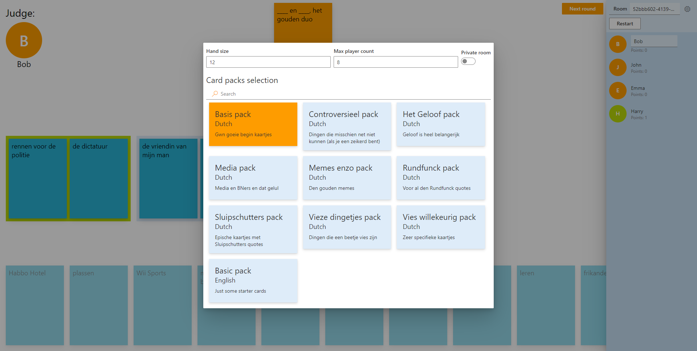
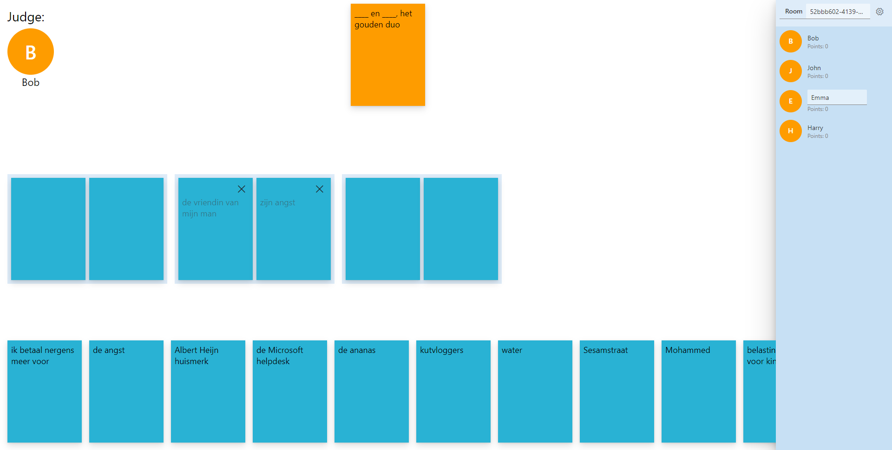
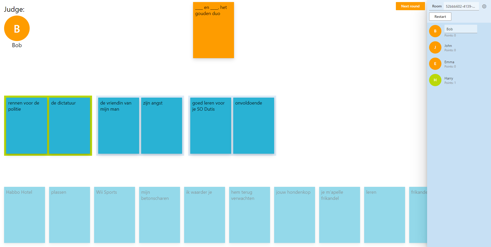
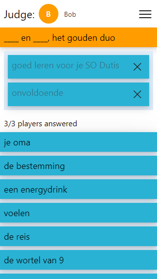
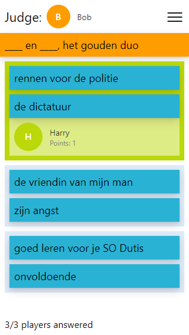

# ThemCards

You know, them cards

Playable at [themCards.herokuapp.com](http://themcards.herokuapp.com/). More card packs coming in the future (if there is traffic, or people submit card packs).

## Game play

Players take turns being the judge of the round. The round starts by a random question card being drawn, which contains blank spaces to be filled in by the rest of the players. These players select one or more cards that they think fits in the empty space. The judge can see selections made by players right away, but not what cards are selected or what player it belongs to. At any moment the judge can decide to start revealing cards, at which point the other players can no longer alter their selection. The judge reveals one selection at a time, making them visible to everyone, and afterwards picks their favorite. Everybody can see who made the selection that won, and that player will receive 1 point. All players lose the cards that they played, a new judge is selected and the next round begins.

Rounds continue indefinitely, and whenever the game runs out of unused cards it will just restock the deck with the used cards. Players can decide on either a time or points limit to decide who the overall winner is, if that's important to them.

## UI

The game contains a mobile/small screen friendly UI and a desktop UI.

In either mode the room data can be shown. This contains a field with the ID/name of the room you're currently in. This field can be altered to navigate to a different room. Next to this field a button is located to open the settings of the room. The first player of the room will be the room's administrator, and will see a 'start game'/'restart' button. Below this section there is a player list, which shows the players in the room with their names and point count. The admin is able to click on players and kick them from the room, if they are unresponsive. Players can alter their own name within this list.

The settings of the room appear as a modal. Here a couple of room setting scan be configured:

-   The maximum capacity
-   Whether the room is private, if it's private people won't automatically be put into this room when opening the website
-   The hand size, I.E. how many cards each player has at a time
-   The card packs, I.E. the cards that can be drawn



### Desktop UI

The desktop UI shows the room/players in a sidebar on the right. In the main area we first see the selected question card, followed by the selections made by all players and the player's own hand. These answer cards sections can overflow to the right, but can be scrolled through using the mousewheel.



### Mobile UI

The mobile UI has a collapsible sidebar showing the room/players. The main area always contains the selected question card on the top, followed by an answer cards area. If the judge hasn't revealed any cards yet, this area is occupied by the player's hand and own selection. Once the judge revealed any cards, the player's hand disappears and the selection of each player is shown instead.



## Development

This project is open source and may be altered/copied by anyone. The initial version was thrown together in a weekend however, so the code quality isn't as good as it could be but also isn't terrible (imo).

### Architecture/technologies

#### Backend

The backend is written in [typescript](https://www.typescriptlang.org/), for [node.js](https://nodejs.org/en/).

#### Frontend

The frontend is written in [typescript](https://www.typescriptlang.org/), and rendered with [react](https://reactjs.org/). I've used my own library [model-react](https://www.npmjs.com/package/model-react) to split the data model from the UI. [fluent-ui](https://developer.microsoft.com/en-us/fluentui) was used as the base components library.

#### Communication

The server hosts the rooms and is the SSOT, clients send commands to the server in order to alter the state, at which point the server broadcasts the change. The communication is handled by [socket.io](https://socket.io/).

### Contributing

Any contributions are appreciated, E.G.:

-   New features such as:
    -   UI translation
    -   Chatting capabilities
    -   A format for repeating the same card with different possessive pronouns in the card pack definitions
    -   ... any number of things that I can't think of
-   Improvement of the design of the site
-   Performance / code quality improvements
-   New card packs or additions to existing card packs:
    -   May also be very niche topics
    -   May also be in other languages that I don't speak (I might ask friends to check it doesn't contain anything too crazy though...)

#### Installation

In order to work on this code, you will have to install [node.js](https://nodejs.org/en/download/).

then run

```
npm install
```

within the root directory of the project.

#### Running

The project contains multiple commands to run the code:

-   `npm run dev` Starts both the server and client in the same terminal
-   `npm run dev-server` Starts the server
-   `npm run dev-client` Starts the client

The server is responsible for hosting the rooms and their data. The client is responsible for hosting the resources that can be opened in the browser, at `localhost:3000`.

Either process watches for typescript code being altered and automatically compiles it to javascript and restarts the server/client. This means that you might need to fully reload the page when a change to the server took place, since it will be restarted.

#### Building

The project contains a command to build the project:

```
npm run build
```

This command will compile the typescript server code down to javascript code that can be run in node and compiles the typescript client code to a single javascript bundle that the server can serve.
When running in production, the server is responsible for both serving the static resources and hosting the rooms.

The command below can be used to run the newly built code:

```
npm run start
```
